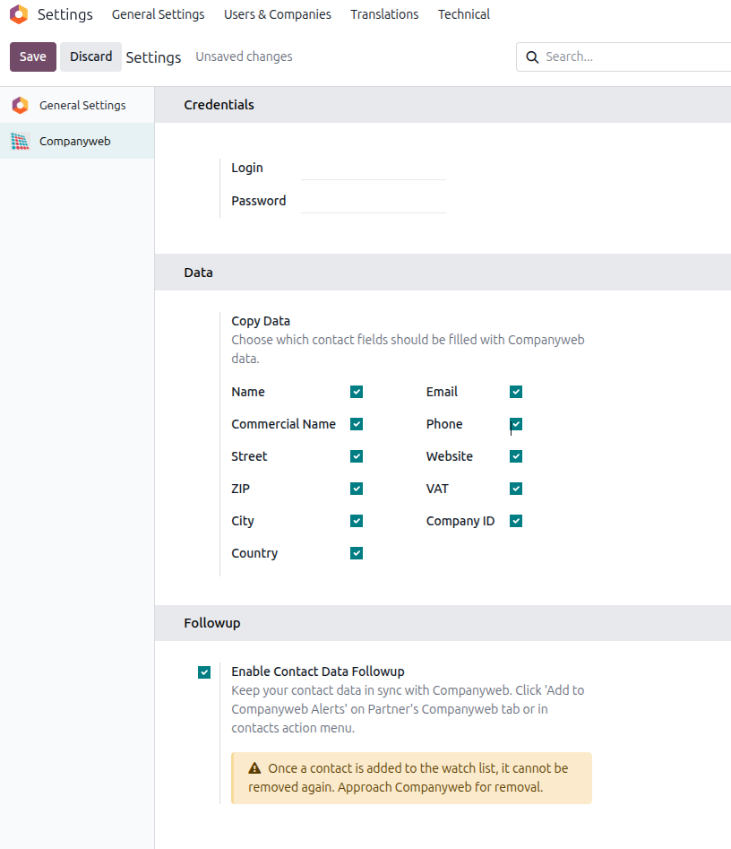
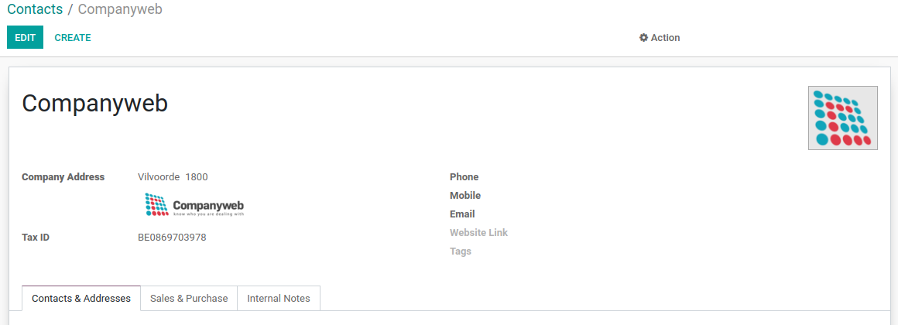
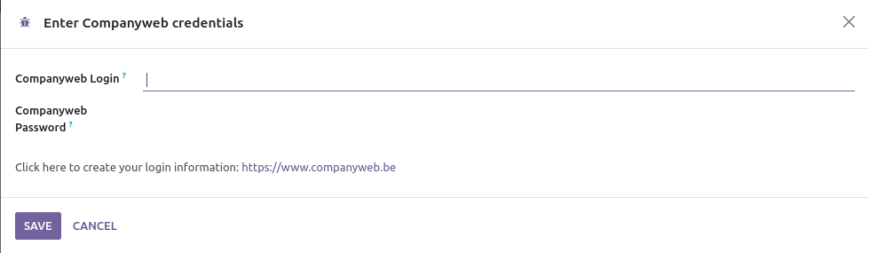
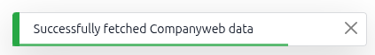
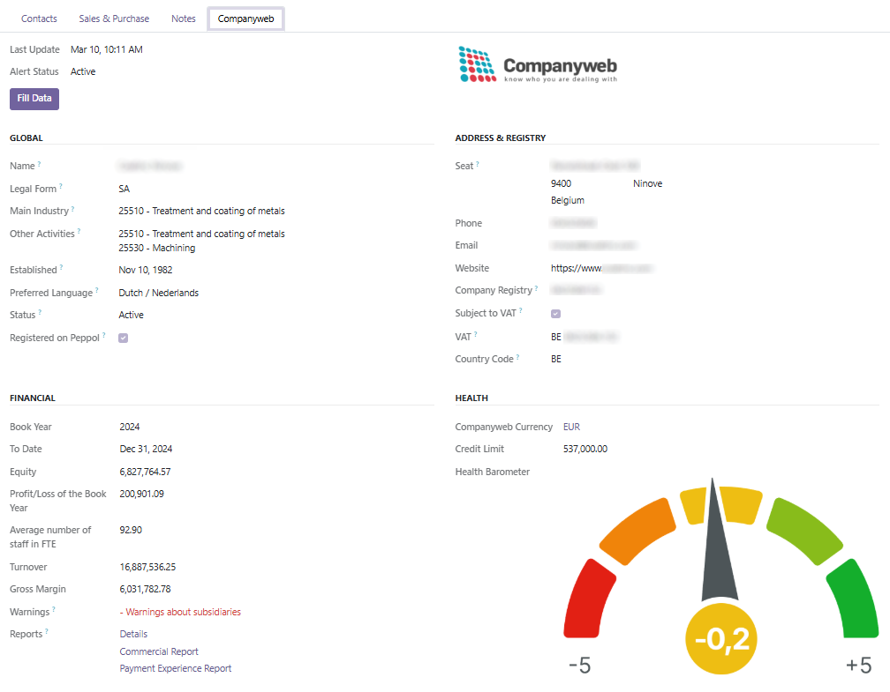
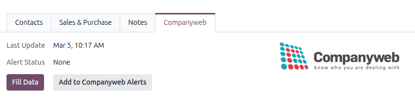

With this integration you get detailed information about a company based
on the VAT number of the company.

## Configuration

Contacts > Configuration > Companyweb

## Security

This module comes with 2 security groups.

  - View Companyweb Data : can see the Companyweb data tab in contacts
  - Download Companyweb Data : can actually enhance data

## Usage

Once your user has the correct permissions, open a partner that has a
belgian VAT number and click on the Companyweb button.

If you don't see the Companyweb button, refresh your browser page and
check that the current user is in the correct Companyweb group.

If your Companyweb credentials are not known in the system or have
changed, you will be shown a wizard to enter them.

If everything runs smoothly you'll see a confirmation popup in the upper
right corner of your screen.

You can now view the Companyweb information in the corresponding tab.

You can also use the "Fill Data" button to update the partner address
with the one obtained from Companyweb.

If enabled, you can add the contact to Companyweb Alerts. The data will automatically
be updated if it has changed on Companyweb.

